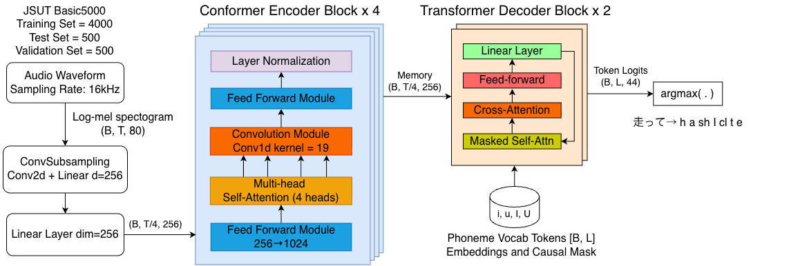
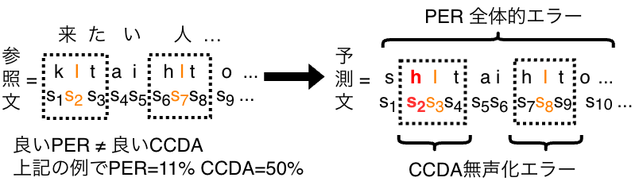

# ASR_JA_Vowel_Devoicing

Japanese speech recognition that outputs **explicit vowel-devoicing tokens**.
A Conformer-encoder / Transformer-decoder seq2seq model is trained on JSUT
basic5000 with `phone_level3`-style transcripts in which devoiced high vowels
are upper-cased (`s U k i` → し is devoiced), so recognition and devoicing
detection happen in a single pass.

Best configuration and other variation of parameter shown in ( [results.md](results.md)) 
Add **KER** as Character-level accuracy in results' table. The kana rendering method
execute in `scripts/kana.py`, take reference from
[nyosegawa/hiragana-asr](https://github.com/nyosegawa/hiragana-asr)).

## Repository layout

```
train_r3.py               training entrypoint (phone3, stratified split)
inference_r3.py           CLI inference + devoicing evaluation
eval_phone3_testset.py    batch test-set evaluation over checkpoints
gradio_demo.py            browser demo (record / pick JSUT wav, 2 checkpoints)
scripts/                  internal library + task scripts
  phone_tokenizer.py        JapaneseRomajiRevTokenizer3 (phone3 vocab)
  stratified_sampling.py    stratified manifest builder + load_splits()
  devoicing_eval.py         devoiced-vowel confusion-matrix scoring
  audio.py                  pitch / RMS extraction for the demo plots
  inference_r.py            shared decode/model-loading internals
  gradio_demo_r.py          shared demo UI helpers (plots, playhead)
  make_transcript_phone3_rev.py   preprocessing: basic5000.yaml → transcript + vocab
models/                   trained weights (git-lfs)
  model_bs8_lr1e-3_dw5.pt   (shipped checkpoint: bs8, lr1e-3, devo_weight=5)
results.md                results tables
doc/                      tokenizer vocabularies + run notes
img/                      confusion matrices, distributions, architecture diagrams
dataset/jsut_ver1.1/basic5000/
  wav/                    ← EMPTY: download JSUT and place the 5000 wavs here
  transcript_phone3_rev.txt      training/eval transcript (devoiced I/U)
  transcript_utf8_rev.txt        revised surface-text transcript (demo display)
  stratified_manifest.csv        train/val/test split manifest
  train_paths.txt / val_paths.txt / test_paths.txt
  basic5000.yaml                 JSUT labels (preprocessing input)
```

## Setup

Requires Python ≥ 3.12. With [uv](https://docs.astral.sh/uv/):

```bash
uv sync                      # creates .venv from pyproject.toml / uv.lock
source .venv/bin/activate
```

or plain pip:

```bash
python3 -m venv .venv && source .venv/bin/activate
pip install -r requirements.txt
```

### Dataset

Audio is not redistributed. Download **JSUT ver 1.1**
(https://sites.google.com/site/shinnosuketakamichi/publication/jsut) and copy
`jsut_ver1.1/basic5000/wav/*.wav` (5000 files) into
`dataset/jsut_ver1.1/basic5000/wav/`.

## Pipeline

### 1. Preprocessing (optional — outputs are already committed)

Regenerates the phone3 transcript and tokenizer vocabulary from
`basic5000.yaml`:

```bash
python scripts/make_transcript_phone3_rev.py
```

Writes `dataset/.../transcript_phone3_rev.txt` and
`doc/tokenizer_romaji_rev_vocab.json`.

### 2. Training

```bash
python train_r3.py
```

- Logs to [Weights & Biases](https://wandb.ai): run `wandb login` first, or
  set `WANDB_MODE=offline` (an `.env` file with `WANDB_API_KEY=…` at the repo
  root is also picked up).
- Edit the `BS` / `LR` / `DEVO_WEIGHT` constants in `train_r3.py` for the sweep grid; each run
  saves `models/train_phone3_<date>_bs{BS}_lr{LR}_dw{DEVO_WEIGHT}_stratified.pt`
  and appends to `doc/results_phone3.csv`.

### 3. Inference

```bash
# single / multiple files
python inference_r3.py path/to/audio.wav --checkpoint models/model_bs8_lr1e-3_dw5.pt

# JSUT test split + devoicing confusion matrix (needs the wavs)
python inference_r3.py --eval-scope test
```

Without `--checkpoint` the newest `models/*.pt` is used.

### 4. Test-set evaluation over all checkpoints

```bash
python eval_phone3_testset.py            # per-checkpoint PER + KER + devoicing P/R/F1
```

Confusion-matrix PNGs go to `img/`, tables to `doc/`.

### 5. Gradio demo

```bash
python gradio_demo.py
```

Record from the microphone or pick a JSUT wav, choose the shipped checkpoint
(`model_bs8_lr1e-3_dw5`, or any other `*.pt` you've trained locally) in the
dropdown, and get the phone3 transcript with devoiced vowels highlighted plus
mel / pitch / RMS plots. Launches with `share=True` (public gradio link).

## Model

| | |
|---|---|
| Encoder | Conformer × 4 (d_model 256, 4 heads, FF 1024, conv kernel 19) |
| Decoder | Transformer × 2 |
| Subsampling | Conv2d ×4 downsample |
| Audio | 16 kHz, 80 mel, n_fft 1024, hop 256 |
| Tokens | phone3 vocab (`doc/tokenizer_romaji_rev_vocab.json`), devoiced `I`/`U` |



PER alone doesn't tell you whether devoicing was scored correctly — a low PER can still hide wrong devoicing context (CCDA). See `results.md` for the full metric definitions:


PER score by predicting all phonemes produced by ASR and compare to ground truth. But, vowel devoicing occurs in specific phonological contexts. This context oftenly occur when vowel (i, u) is preceded and followed by a voiceless consonant. Therefore, aside of PER, we need CCDA (Context-Conditioned Devoicing Accuracy) as a local window to measure whether the devoiced vowel is in the correct context. CCDA is computed by checking if the devoiced vowel mark detected, they will extract three-phonemes  as set compare with ground truth's set.
## Example

```bash
python inference_r3.py dataset/jsut_ver1.1/basic5000/wav/BASIC5000_0001.wav --checkpoint models/model_bs8_lr1e-3_dw5.pt
```

```
Loaded checkpoint: model_bs8_lr1e-3_dw5.pt
  epoch=99  test_PER=2.61%  KER=3.42%  CCDA=93.40%  cmvn=False  device=cuda

Transcript
BASIC5000_0001: 水をマレーシアから買わなくてはならないのです。

Prediction
BASIC5000_0001: m i z u o m a r e e sh i a k a r a k a w a n a k [U] t e w a n a r a n a i n o d e s [U]
devoicing C1·[V]·C2: k·[U]·t, s·[U]·<eos>
```

Vowel devoicing is marked with upper-case `I` for voiceless "i" or `U` for voiceless "u" in the transcript.

## Publishing to GitHub

The shipped checkpoint (~96 MB) is tracked with **git-lfs**:

```bash
git lfs install
git remote add origin git@github.com:<you>/ASR_JA_Vowel_Devoicing.git
git push -u origin main
```
